# What can history tell us before kickoff?

## Before a 2026 group-stage match…

Pick a fixture and ask:

- **Head-to-head**: who leads on wins and draws?
- **Recent form**: how has each team played in their last 10 matches?
- **Scope**: all meetings or **World Cup only**? Which years count?

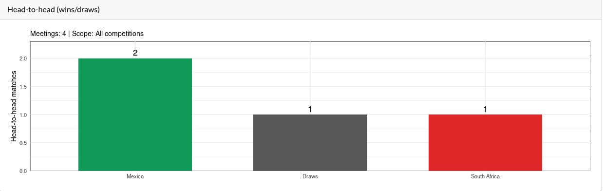{fig-alt="Head-to-head bar chart for Mexico vs South Africa showing 2 wins for Mexico, 1 draw, and 1 win for South Africa." width="92%"}

::: {.notes}
Optional: ask the room one question they care about before moving to data.
:::

---

## Free data for soccer is hard to find

Compared with many North American sports, **open, clean, match-level international football data** is scarce:

- League APIs are often paid, fragmented, or terms-restricted
- Aggregators rarely cover **1872 → today** in one place
- Men's full internationals (not Olympics, not B-teams) are easy to mix up

That gap is why one community dataset matters.

---

## Data source: [martj42/international_results](https://github.com/martj42/international_results)

**Special thanks** to [martj42/international_results](https://github.com/martj42/international_results): a maintained, **free** dataset of men's international matches:

- **~49,000+ results** from the first official match (1872) through recent years
- World Cups, friendlies, continental tournaments: one consistent schema
- Companion files: goalscorers, shootouts, former country names
- **CC0** license: use and share with attribution

Also on [Kaggle](https://www.kaggle.com/datasets/martj42/international-football-results-from-1872-to-2017) · contributions welcome via PRs on GitHub

::: {.notes}
Say clearly: "I did not build this raw history. I stand on martj42's work."
:::

---

## What we use in this project

Copies live under `data/international/` in [world_cup_analytics](https://github.com/rabin0208/world_cup_analytics) (bundled for offline Shiny demos):

| File | Role |
|------|------|
| `results.csv` | Matches: date, teams, scores, tournament, venue |
| `goalscorers.csv` | Goal events linked to matches |
| `shootouts.csv` | Penalty shootouts |
| `former_names.csv` | Historical country name mappings |

Same columns in the warehouse as in the bundled CSV: one schema from upload through the app.

---

## End-to-end pipeline

```{mermaid}
%%| fig-width: 9
flowchart LR
  CSV[data/international/results.csv] --> GCS[GCS raw/]
  GCS --> BQ[analytics.international_results]
  BQ --> Shiny[Shiny bq_table_download]
  CSV -.->|USE_BIGQUERY=FALSE| Shiny
```

**Upload** refreshes the warehouse. **Explore** reads `international_results` from BigQuery at startup.

**In BigQuery** (`analytics.international_results`):

- One row per match: `date`, `home_team`, `away_team`, `home_score`, `away_score`
- Context: `tournament`, `city`, `country`, `neutral`
- Same column names as the bundled CSV, so upload and Shiny share one schema

---

## GCP setup (one-time)

Before the upload script, create a personal GCP project with **BigQuery** and **Cloud Storage**:

| Step | Console task |
|------|----------------|
| 1 | Create project |
| 2 | Enable BigQuery + Cloud Storage APIs |
| 3 | Create dataset `analytics` or similar |
| 4 | Create bucket `football-analytics` (or similar) |
| 5 | Service account + download JSON key |
| 6 | Run `upload_international_results.R` |
| 7 | Point `.env` at project and verify table |

::: {.notes}
This block is the “how to reproduce the warehouse” walkthrough. Use light-mode screenshots.
:::

---

## Step 1: Create a GCP project

Go to [console.cloud.google.com](https://console.cloud.google.com) with your Google account.

- **New project** name: e.g. `football-analytics` (pick any clear name)
- **Organization:** No organization (for easier sharing)
- **Save the Project ID** (e.g. `football-analytics-496219`):

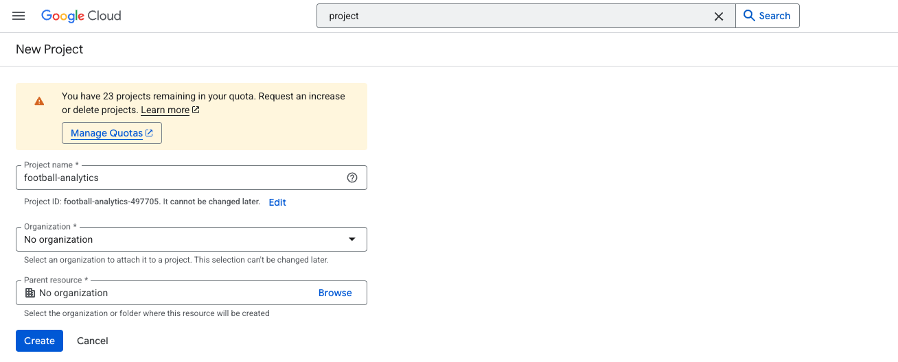{fig-alt="GCP new project screen." width="88%"}

---

## Step 2: Enable APIs

In the console, open **APIs & Services → Library** and enable:

- **BigQuery API**
- **Cloud Storage API**

Filter by name if needed and click **Enable** on each.

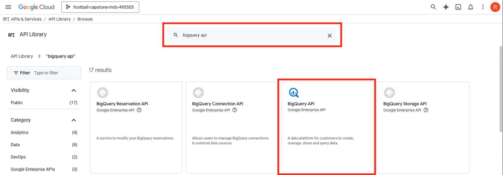{fig-alt="Enable BigQuery and Cloud Storage APIs in GCP." width="88%"}

---

## Step 3: Create the BigQuery dataset

In **BigQuery → Explorer**, select your project and click **Create dataset**.

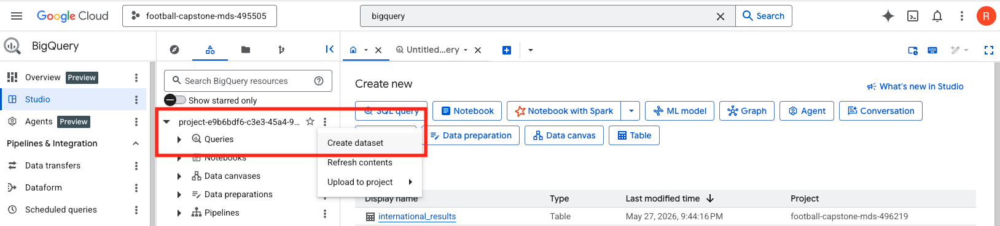{fig-alt="BigQuery create dataset screen." width="88%"}

Then choose the name of your dataset.

---

## Step 3 (continued): Create the BigQuery dataset

- **Dataset ID:** `analytics`
- **Location:** same region you will use for Storage (e.g. `US` or `northamerica-northeast1`)

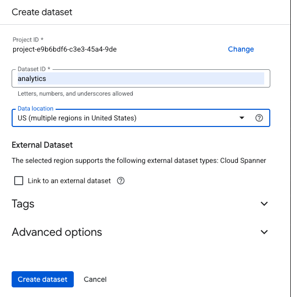{fig-alt="BigQuery dataset created in Explorer." width="88%"}

---

## Step 4: Create the GCS bucket

Open **Cloud Storage → Buckets** and click **Create**.

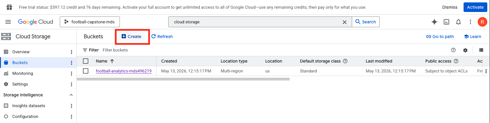{fig-alt="Cloud Storage buckets page with Create bucket action." width="88%"}

---

## Step 4 (continued): Configure bucket name and region

- **Name:** `football-analytics-496219`
- **Location:** match your BigQuery dataset region

Upload script writes dated files under:

`raw/international/results/YYYY-MM-DD/results.csv`

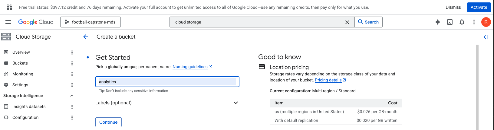{fig-alt="Cloud Storage bucket naming and location settings." width="88%"}

---

## Step 5: Service account and JSON key

In **IAM & Admin → Service Accounts**, click **Create service account**.

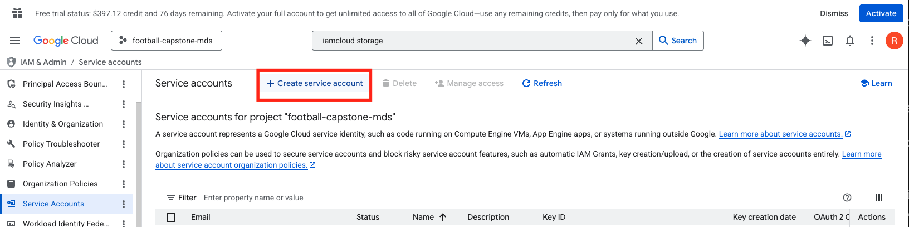{fig-alt="Service accounts page with Create service account action." width="88%"}

---

## Step 5 (continued): Name account and set permissions

- Name: e.g. `football-analytics`
- Grant roles (minimum for this repo):
  - **BigQuery Admin** (or BigQuery Data Editor + BigQuery Job User)
  - **Storage Admin** (or Storage Object Admin on the bucket)

::: {.columns}
::: {.column width="50%"}
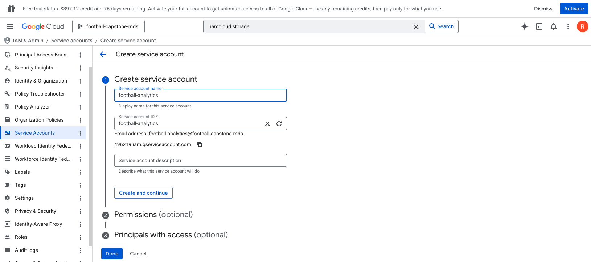{fig-alt="Service account naming step." width="100%"}
:::
::: {.column width="50%"}
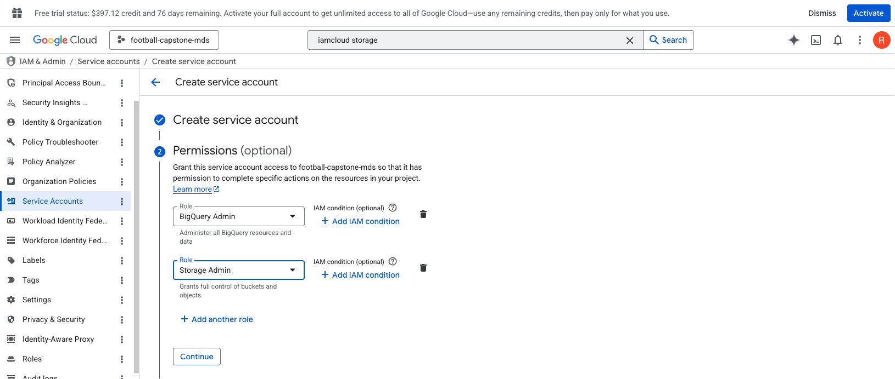{fig-alt="Service account permissions step." width="100%"}
:::
:::

---

## Step 5 (continued): Add service account key

Use the created service account to generate a JSON key for local auth:

**Service Accounts → your account → Keys → Add key → Create new key → JSON**

::: {.columns}
::: {.column width="50%"}
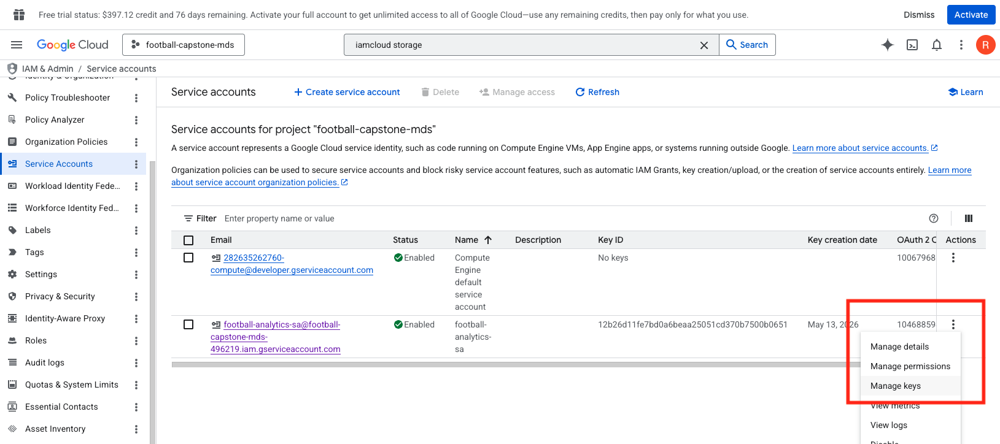{fig-alt="Service account keys tab with add key action." width="100%"}
:::
::: {.column width="50%"}
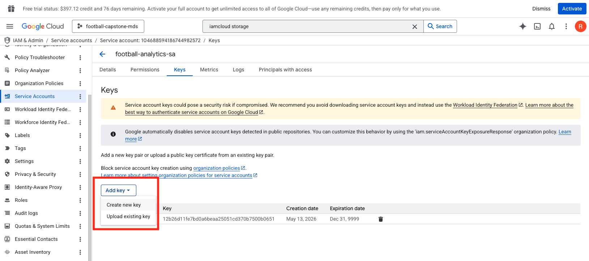{fig-alt="Create JSON key dialog." width="100%"}
:::
:::

---

## Step 6: Run the R upload script

From the **world_cup_analytics** repo root (with `.env` filled in, next slide):

```bash
Rscript src/upload_international_results.R
```

The script:

1. Uploads `data/international/results.csv` to your GCS prefix
2. Loads into `YOUR_PROJECT_ID.analytics.international_results` (`WRITE_TRUNCATE`)

In Cloud Storage, confirm a dated object path appears under:

`raw/international/results/YYYY-MM-DD/results.csv`

---

## Upload: R to GCS and BigQuery

`upload_international_results.R` in the **world_cup_analytics** repo:

1. `gcs_upload()`: dated prefix under `raw/international/results/`
2. `read_csv()` with explicit types (`NA` scores → NULL)
3. `bq_table_upload()`: `WRITE_TRUNCATE` into `analytics.international_results`

Re-run when martj42's dataset updates. The live app picks up the new table on next deploy.

::: {.notes}
Optional live run in RStudio (~10-20 s) to show row count after load.
:::

---

## Upload script

```r
gcs_upload(local_csv, name = gcs_object)
results <- read_csv(
  local_csv,
  na = c("", "NA"),
  col_types = cols(
    date = col_date(),
    home_score = col_integer(),
    away_score = col_integer(),
    neutral = col_logical(),
    .default = col_character()
  )
)
bq_table_upload(
  bq_table(project_id, "analytics", "international_results"),
  results,
  write_disposition = "WRITE_TRUNCATE"
)
```

---

## Step 7: Verify in BigQuery

In **BigQuery → `analytics` → `international_results`**:

- Open **Schema** or **Preview** and confirm columns/row count

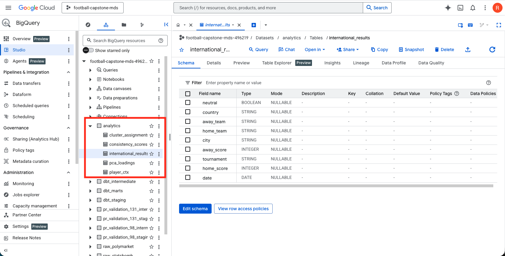{fig-alt="BigQuery schema for analytics.international_results." width="92%"}

---

## Shiny reads from BigQuery

At startup, `app.R` loads match history with `bq_table_download()`:

```r
dest <- bq_table(project_id, "analytics", "international_results")
results <- bq_table_download(dest, bigint = "integer")
```

Set in `.env` on Connect (or locally):

- `USE_BIGQUERY=TRUE`
- `GCP_PROJECT_ID`, `GOOGLE_APPLICATION_CREDENTIALS`

Same dplyr prep after load: dates, `is_played`, World Cup flags, H2H helpers.

::: {.notes}
Say: "The warehouse is the source of truth; dplyr logic is unchanged after the download."
:::

---

## Explore: logic first, UI second

**World Cup Analytics** (`app.R`) is a thin Shiny layer over plain R functions in `src/R/analytics.R`.

- Inputs (fixture + scope) trigger **reactives**
- Outputs (chart + tables) call the same **dplyr** helpers every time
- No special query language: regular **tidyverse** on a data frame

{fig-alt="H2H bar chart output from dplyr summaries." width="78%"}

---

## Prep with regular tidyverse

After load (CSV or BigQuery), `app.R` builds views with standard verbs:

```r
wc_results <- results |> filter(is_wc_tournament(tournament))
wc_played <- wc_results |> filter(is_played(home_score, away_score))
wc_upcoming <- wc_results |>
  filter(!is_played(home_score, away_score)) |>
  arrange(date, home_team)
played_results <- results |> filter(is_played(home_score, away_score))
```

**Idea:** separate *played history*, *upcoming fixtures*, and *World Cup scope* before any UI renders.

---

## Head-to-head: `filter` + `arrange`

`h2h_matches()` keeps meetings between the two teams, newest first:

```r
h2h_matches <- function(team_a, team_b, data) {
  data |>
    filter(
      (home_team == team_a & away_team == team_b) |
        (home_team == team_b & away_team == team_a)
    ) |>
    arrange(desc(date))
}
```

`h2h_summary()` counts wins/draws from each team's perspective (home or away in that row).

---

## Scope filter: all competitions vs World Cup

User picks scope in the sidebar; the server applies one more `filter`:

```r
d <- h2h_matches(fx$home_team, fx$away_team, played_results)
if (identical(input$h2h_scope, "wc")) {
  d <- d |> filter(is_wc_tournament(tournament))
}
```

Same pattern for **last 10 games** tables per team.

---

## Recent form: `slice_head` + `mutate` + `select`

```r
team_last_matches <- function(team_name, played_results, scope) {
  d <- played_results |>
    filter(home_team == team_name | away_team == team_name)
  if (identical(scope, "wc")) {
    d <- d |> filter(is_wc_tournament(tournament))
  }
  d |>
    arrange(desc(date)) |>
    slice_head(n = 10) |>
    mutate(
      Result = sprintf("%d - %d", home_score, away_score),
      Venue = ifelse(home_team == team_name, "Home", "Away"),
      Opponent = ifelse(home_team == team_name, away_team, home_team)
    ) |>
    select(Date = date, Team, Opponent, Result, Venue,
           Tournament = tournament, City = city)
}
```

**Takeaway:** the dashboard is a viewer; the analysis is dplyr you could run in a script or Quarto doc.

::: {.notes}
Optional live demo: run `h2h_matches("Mexico", "South Africa", played_results)` in the console to show the table behind the chart.
:::

---

## From description to a naive forecast

The dashboard answers **what happened** between two countries.

The simplest “prediction” step: **turn head-to-head counts into probabilities**

$$
\begin{aligned}
P(\text{A wins}) &\approx \frac{w_A}{n} \\
P(\text{draw})   &\approx \frac{d}{n} \\
P(\text{B wins}) &\approx \frac{w_B}{n}
\end{aligned}
$$

where $n = w_A + d + w_B$: wins and draws from filtered past meetings.

No training step: just **historical frequencies** from match-level data.

::: {.notes}
Emphasize: this is a teaching sketch, not a betting model. Small $n$ → noisy.
:::

---

## Sanity check: overall match rates

Before trusting a rivalry’s history, know the **base rates** in the full results file:

```{r}
#| label: fig-baseline-rates
#| fig-cap: "Share of home win, draw, and away win"
#| fig-width: 7
#| fig-height: 3.5
library(ggplot2)

baseline <- data.frame(
  outcome = factor(c("Home win", "Draw", "Away win"),
                   levels = c("Home win", "Draw", "Away win")),
  rate = c(0.50, 0.25, 0.25)
)

ggplot(baseline, aes(x = outcome, y = rate, fill = outcome)) +
  geom_col(alpha = 0.85, width = 0.6) +
  geom_text(aes(label = scales::percent(rate, accuracy = 0.1)),
            vjust = -0.4, fontface = "bold") +
  scale_y_continuous(labels = scales::percent_format(), limits = c(0, 0.6)) +
  scale_fill_manual(values = c("Home win" = "#2d7a32", "Draw" = "#ff9800", "Away win" = "#c62828")) +
  labs(x = NULL, y = "Share of matches") +
  theme_minimal() +
  theme(legend.position = "none")
```

**Benchmark:** any fancier model should beat “always predict home win” on out-of-sample matches.

---

## Example: Mexico vs South Africa (empirical H2H)

Same logic as `h2h_summary()` in the app: count wins from each team’s perspective.

```{r}
#| label: fig-h2h-naive-prob
#| fig-cap: "Naive win/draw probabilities from head-to-head history"
#| fig-width: 7
#| fig-height: 3.5
library(ggplot2)

team_a <- "Mexico"
team_b <- "South Africa"

h2h_probs <- function(team_a, team_b, played) {
  m <- played[
    (played$home_team == team_a & played$away_team == team_b) |
      (played$home_team == team_b & played$away_team == team_a),
  ]
  if (nrow(m) == 0) {
    return(NULL)
  }
  wa <- dr <- wb <- 0L
  for (i in seq_len(nrow(m))) {
    row <- m[i, ]
    if (row$home_team == team_a) {
      ga <- row$home_score
      gb <- row$away_score
    } else {
      ga <- row$away_score
      gb <- row$home_score
    }
    if (ga > gb) wa <- wa + 1L else if (ga < gb) wb <- wb + 1L else dr <- dr + 1L
  }
  n <- wa + dr + wb
  data.frame(
    outcome = c(team_a, "Draw", team_b),
    rate = c(wa, dr, wb) / n,
    matches = n
  )
}

data_path <- file.path("..", "world_cup_analytics", "data", "international", "results.csv")

if (file.exists(data_path)) {
  if (!exists("played")) {
    raw <- read.csv(data_path, stringsAsFactors = FALSE, na.strings = c("", "NA"))
    played <- raw[!is.na(raw$home_score) & !is.na(raw$away_score), ]
  }
  probs <- h2h_probs(team_a, team_b, played)
  if (is.null(probs)) {
    probs <- data.frame(
      outcome = c(team_a, "Draw", team_b),
      rate = c(0.50, 0.25, 0.25),
      matches = 4L
    )
  }
} else {
  probs <- data.frame(
    outcome = c(team_a, "Draw", team_b),
    rate = c(0.50, 0.25, 0.25),
    matches = 4L
  )
}

probs$outcome <- factor(probs$outcome, levels = c(team_a, "Draw", team_b))

ggplot(probs, aes(x = outcome, y = rate, fill = outcome)) +
  geom_col(alpha = 0.85, width = 0.6) +
  geom_text(aes(label = scales::percent(rate, accuracy = 0.1)),
            vjust = -0.4, fontface = "bold") +
  scale_y_continuous(labels = scales::percent_format(), limits = c(0, 0.65)) +
  scale_fill_manual(values = c("#2d7a32", "#ff9800", "#c62828")) +
  labs(
    x = NULL, y = "Naive probability",
    title = paste0("Based on ", probs$matches[1], " past meetings")
  ) +
  theme_minimal() +
  theme(legend.position = "none", plot.title = element_text(hjust = 0.5, face = "bold"))
```

**Talking point:** “In 4 Mexico-South Africa meetings, Mexico has 2 wins, South Africa 1, and 1 draw, so the naive probabilities are 50%, 25%, and 25%. This is useful as a baseline, but noisy with small $n$.”

---

## What this is, and what’s next

| With match-level CSV / BQ | Needs event or lineup data |
|---------------------------|-----------------------------------------------|
| Empirical H2H, home/draw/away baselines | xG, player form, tactical matchups |
| Elo / simple glm on team strength | Club vs international windows with lineups |

**This talk:** exploration + **one** naive forecast, enough to connect to your abstract’s “prediction sketch.”

**Later:** Multinomial model for home/draw/away outcomes, plus more dashboard views using additional tables.

---

## Future work

- [ ] Elo or `glm()` on played games (first step beyond naive frequencies)
- [ ] Add player- and lineup-level features to build a stronger pre-match model
- [ ] `goalscorers` (and shootouts) into BigQuery for richer views
- [ ] Additional dashboard tabs (overview, teams, goalscorers) on top of the WC fixture view
- [ ] Compare lineup-aware model vs team-only baseline on out-of-sample matches

---

## Want to learn more?

**Data (source dataset):**

[https://github.com/martj42/international_results](https://github.com/martj42/international_results)

**This project: Shiny app & pipeline:**

[https://github.com/rabin0208/world_cup_analytics](https://github.com/rabin0208/world_cup_analytics)

**This deck:**

[https://github.com/rabin0208/world_cup_analytics_presentation](https://github.com/rabin0208/world_cup_analytics_presentation)

Render with Quarto:

```bash
quarto render index.qmd
```

# Thank you!

::: {.notes}
Thank audience.
:::
